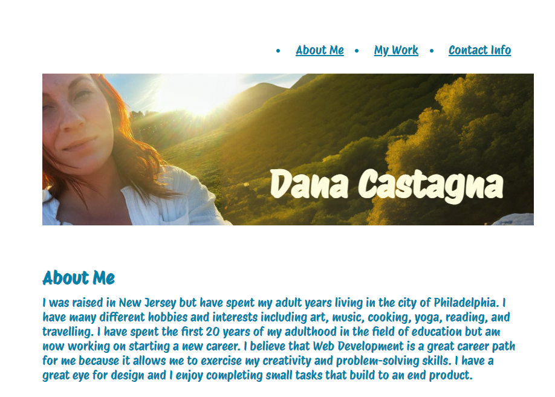
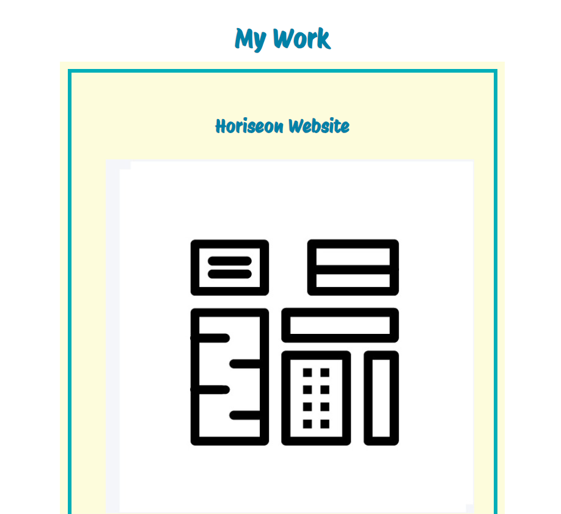
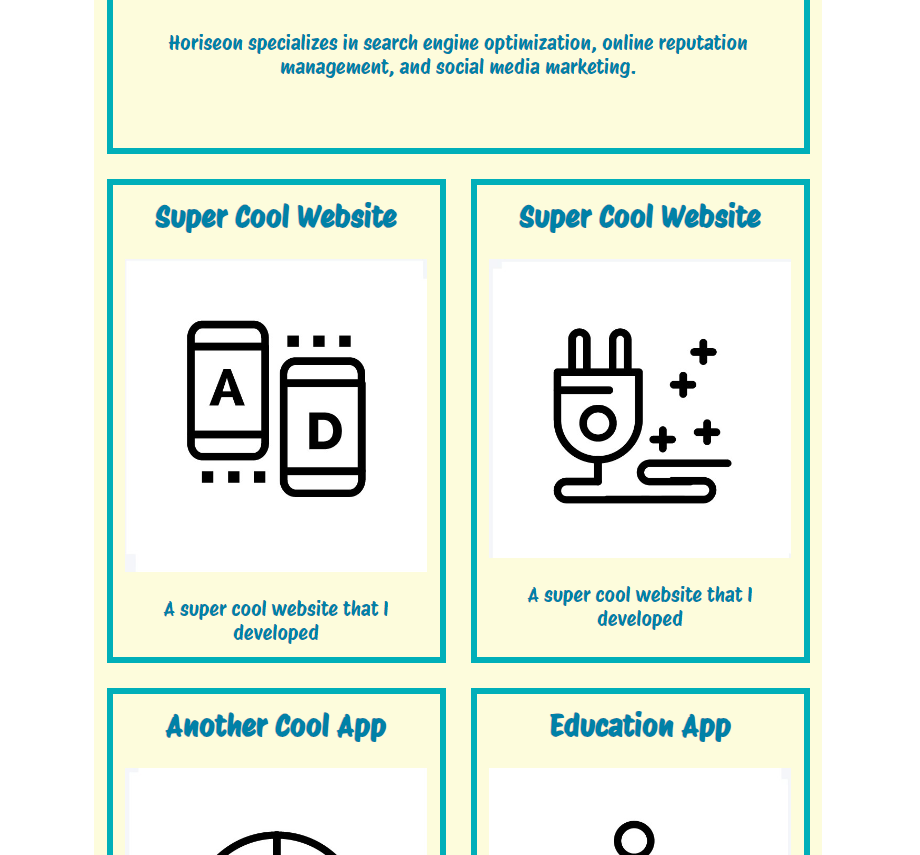
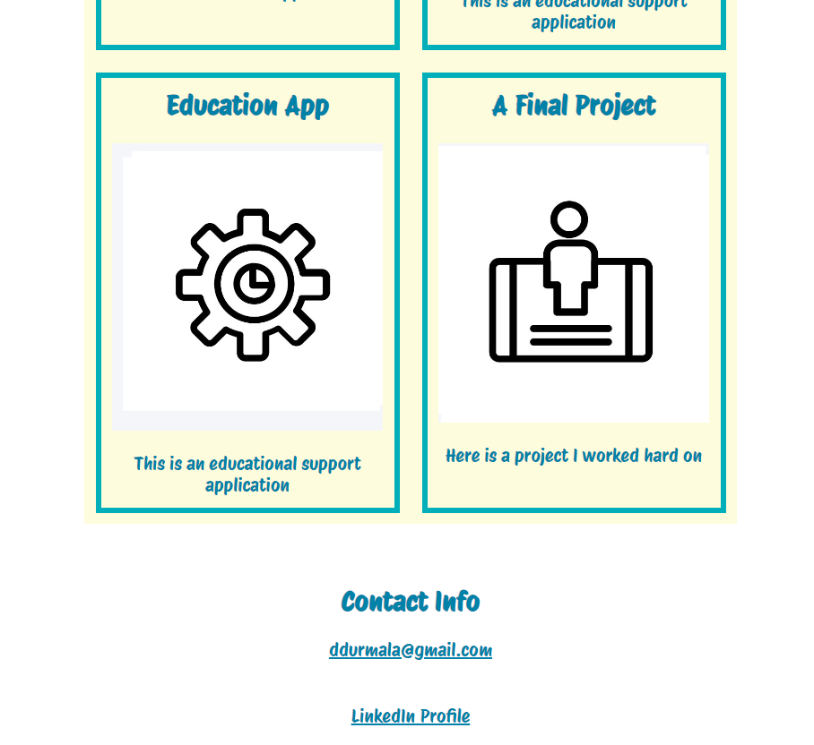

# dana_prof_portfolio

## Description

This project is a beginner website my my own professional portfolio.  It aims to share information about myself as well as allow access to different projects I have worked on. The webpage also contains my contact information so potential employers can get in touch with me and checkout my LinkedIn profile.

## Installation 

website can be accessed at: https://ddurmala.github.io/dana_prof_portfolio/

## Usage

## Credits

coded and designed by Dana Castagna

## License
MIT License

Copyright (c) 2024 JD Tadlock

Permission is hereby granted, free of charge, to any person obtaining a copy
of this software and associated documentation files (the "Software"), to deal
in the Software without restriction, including without limitation the rights
to use, copy, modify, merge, publish, distribute, sublicense, and/or sell
copies of the Software, and to permit persons to whom the Software is
furnished to do so, subject to the following conditions:

The above copyright notice and this permission notice shall be included in all
copies or substantial portions of the Software.

THE SOFTWARE IS PROVIDED "AS IS", WITHOUT WARRANTY OF ANY KIND, EXPRESS OR
IMPLIED, INCLUDING BUT NOT LIMITED TO THE WARRANTIES OF MERCHANTABILITY,
FITNESS FOR A PARTICULAR PURPOSE AND NONINFRINGEMENT. IN NO EVENT SHALL THE
AUTHORS OR COPYRIGHT HOLDERS BE LIABLE FOR ANY CLAIM, DAMAGES OR OTHER
LIABILITY, WHETHER IN AN ACTION OF CONTRACT, TORT OR OTHERWISE, ARISING FROM,
OUT OF OR IN CONNECTION WITH THE SOFTWARE OR THE USE OR OTHER DEALINGS IN THE
SOFTWARE.

## Features

- information about Dana Castagna
- Dana's work/projects
- contact inofrmation for Dana Castagna
